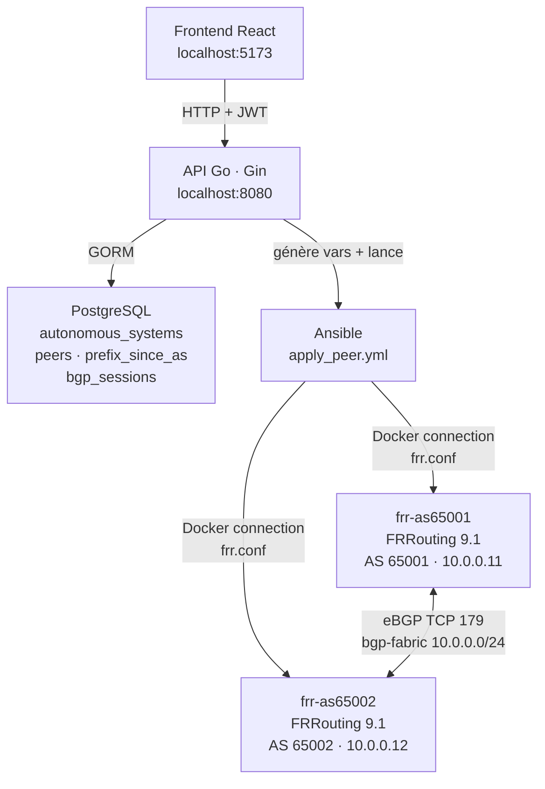
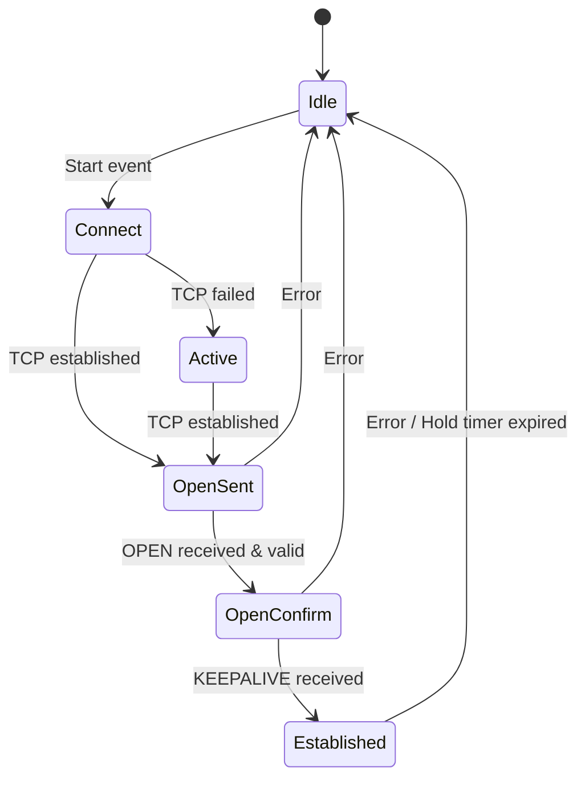
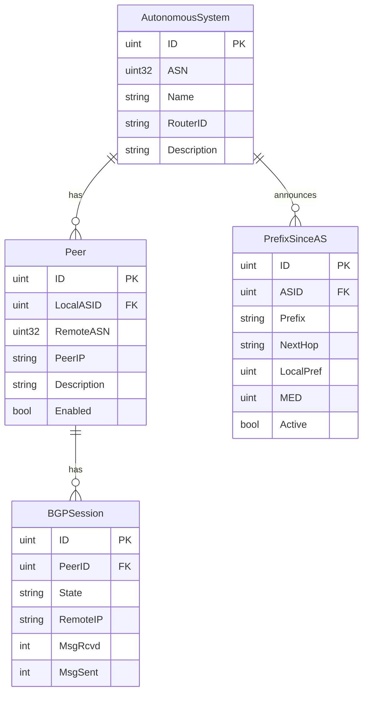
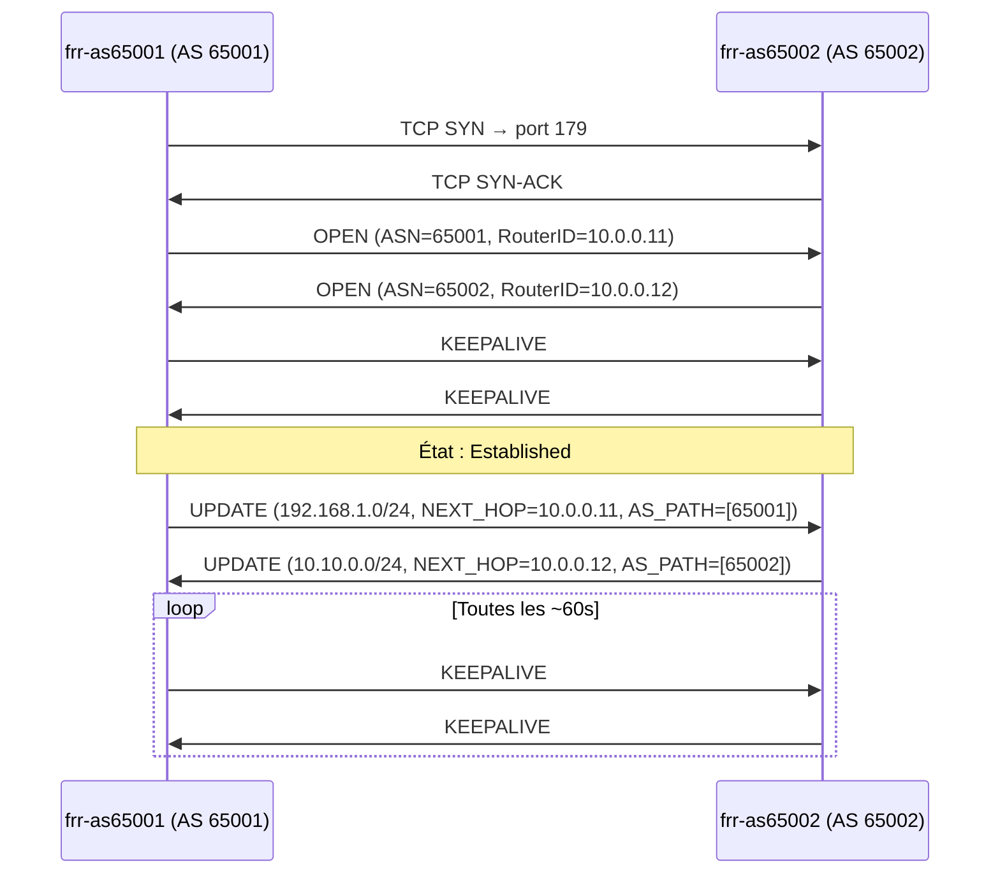
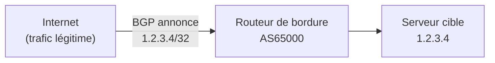
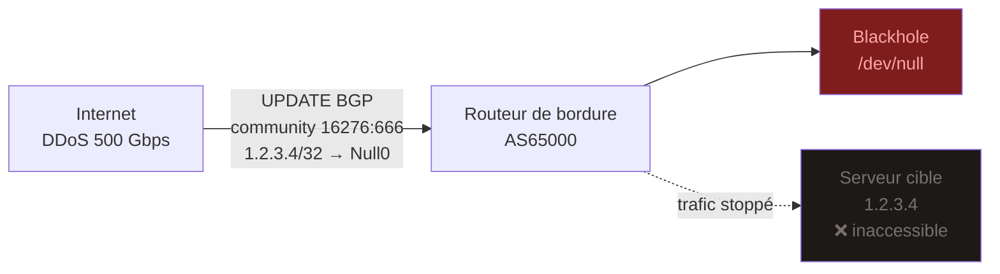
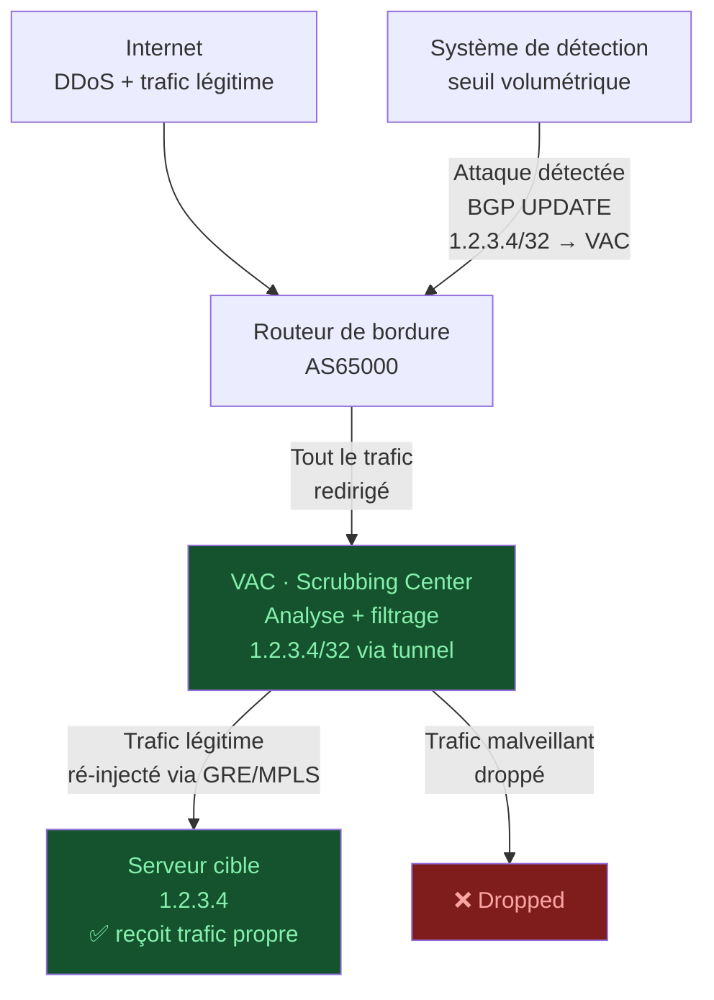
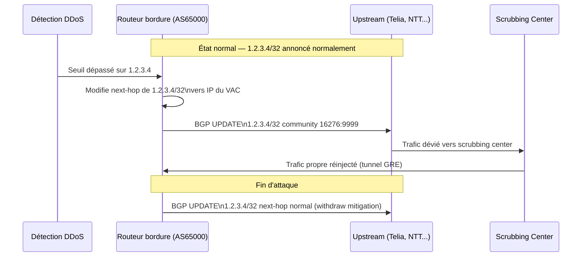
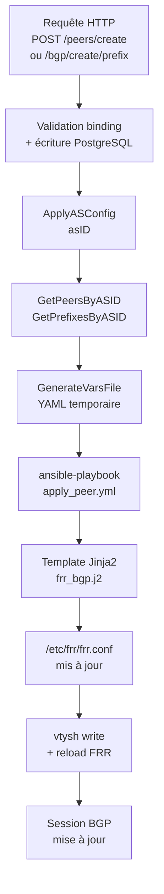

# BGP Simulator

Simulateur de routage BGP reproduisant les mécanismes des grands opérateurs réseau.
Combine une API Go, des containers FRRouting, Ansible pour la configuration dynamique, et un frontend React.

---

## Sommaire

1. [Architecture générale](#architecture-générale)
2. [Le protocole BGP](#le-protocole-bgp)
3. [Autonomous Systems](#autonomous-systems)
4. [BGP inter-AS](#bgp-inter-as)
5. [Mitigation DDoS via BGP](#mitigation-ddos-via-bgp)
6. [API — Endpoints](#api--endpoints)
7. [Flux de configuration](#flux-de-configuration)
8. [Lancer le projet](#lancer-le-projet)

---

## Architecture générale



---

## Le protocole BGP

**BGP (Border Gateway Protocol)** est le protocole de routage qui fait fonctionner Internet.
Défini par la [RFC 4271](https://datatracker.ietf.org/doc/html/rfc4271), il opère sur **TCP port 179**.

Contrairement aux protocoles IGP (OSPF, IS-IS) qui cherchent le chemin le plus court,
BGP est un **protocole à vecteur de chemin** — il choisit la route selon des **politiques** (policies).

### Machine à états (FSM — RFC 4271 §8)



| État          | Description                                                              |
|---------------|--------------------------------------------------------------------------|
| `Idle`        | BGP inactif, en attente d'un événement de démarrage                     |
| `Connect`     | Tentative de connexion TCP vers le voisin (port 179)                    |
| `Active`      | TCP échoué, BGP réessaie activement                                     |
| `OpenSent`    | TCP établi, message OPEN envoyé — attente de l'OPEN du voisin           |
| `OpenConfirm` | OPEN reçu et validé — attente du KEEPALIVE final                        |
| `Established` | Session active, échange de UPDATE et KEEPALIVE                          |

### Les 4 messages BGP

| Message        | Rôle                                                                    |
|----------------|-------------------------------------------------------------------------|
| `OPEN`         | Ouvre la session : ASN local, Router ID, hold time, capacités           |
| `UPDATE`       | Annonce ou retire des préfixes (NLRI) avec leurs attributs de chemin   |
| `KEEPALIVE`    | Maintien de la session (~60s), confirme aussi l'OPEN                   |
| `NOTIFICATION` | Signale une erreur fatale, ferme immédiatement la session              |

### Attributs de chemin

| Attribut     | Type        | Rôle                                                              |
|--------------|-------------|-------------------------------------------------------------------|
| `AS_PATH`    | Obligatoire | Liste des AS traversés — évite les boucles                       |
| `NEXT_HOP`   | Obligatoire | IP du prochain saut pour atteindre le préfixe                    |
| `LOCAL_PREF` | Optionnel   | Préférence locale (plus élevé = préféré), propagé en iBGP        |
| `MED`        | Optionnel   | Indique au voisin le chemin entrant préféré                      |
| `ORIGIN`     | Obligatoire | Origine : IGP (`i`), EGP (`e`), Incomplete (`?`)                 |

### Sélection de route (Decision Process)

BGP choisit la meilleure route dans cet ordre :

1. `LOCAL_PREF` le plus élevé
2. `AS_PATH` le plus court
3. `ORIGIN` le plus bas (IGP < EGP < Incomplete)
4. `MED` le plus faible
5. eBGP préféré sur iBGP
6. IGP metric la plus faible vers le NEXT_HOP
7. Router ID le plus bas (tie-breaker)

---

## Autonomous Systems

Un **Autonomous System** est un ensemble de réseaux IP sous une même administration,
identifié par un **numéro unique (ASN)**.

| Plage                   | Usage                                    |
|-------------------------|------------------------------------------|
| 1 – 64495               | ASN publics 16 bits (IANA/RIR)          |
| 64512 – 65535           | ASN privés 16 bits (labo/simulation)    |
| 65536 – 4 294 967 295   | ASN 32 bits (RFC 4893)                  |

Exemples réels : Cloudflare = **AS13335** · Google = **AS15169** · Hurricane Electric = **AS6939**

### Modèle en base



---

## BGP inter-AS

### eBGP vs iBGP

| Type  | Contexte                          | NEXT_HOP          | LOCAL_PREF |
|-------|-----------------------------------|-------------------|------------|
| eBGP  | Entre deux AS différents          | Mis à jour        | Non propagé |
| iBGP  | Au sein du même AS                | Non modifié       | Propagé    |

Ce projet simule uniquement de l'**eBGP**.

### Échange de messages lors d'une session



### Configuration FRR générée

Pour qu'AS65001 annonce `192.168.1.0/24` à AS65002 :

```
router bgp 65001
 bgp router-id 10.0.0.11
 no bgp ebgp-requires-policy
 neighbor 10.0.0.12 remote-as 65002
 !
 address-family ipv4 unicast
  network 192.168.1.0/24
  neighbor 10.0.0.12 activate
 exit-address-family
```

> `no bgp ebgp-requires-policy` : FRR 9.x bloque par défaut l'échange de préfixes
> sans route-map explicite (`(Policy)` dans `show bgp summary`). Cette directive lève cette restriction.

---

## Mitigation DDoS via BGP

Quand un serveur est sous attaque DDoS, BGP permet de **rediriger le trafic malveillant**
vers une infrastructure de nettoyage (scrubbing center) avant de renvoyer le trafic légitime
vers le serveur cible via un **scrubbing center**.

### Flux normal (sans attaque)



### Flux sous attaque — BGP Blackhole

Le cas le plus simple : l'IP attaquée est **blackholée** (tout le trafic vers elle est jeté).
Utilisé quand l'attaque est si volumineuse qu'elle sature les liens.



> La community BGP `65000:666` est un signal envoyé aux upstreams.
> Dès réception, chaque opérateur transit jette le trafic vers cette IP avant qu'il n'atteigne le réseau.

### Flux sous attaque — BGP Rerouting vers VAC

Solution plus fine : le trafic est **dévié vers le scrubbing center**, nettoyé, puis réinjecté.



### Mécanisme BGP utilisé



### Les deux techniques comparées

| Technique         | BGP Blackhole                        | BGP Rerouting (VAC)                    |
|-------------------|--------------------------------------|----------------------------------------|
| Trafic légitime   | ❌ Jeté avec le malveillant           | ✅ Nettoyé et réacheminé               |
| Vitesse           | Immédiate (quelques secondes)        | Rapide mais avec analyse (~30s)        |
| Cas d'usage       | Attaque volumétrique extrême         | Attaque standard, service à maintenir  |
| Propagation       | Chez tous les upstreams via community | Interne à l'AS ou vers upstreams proches |

---

## API — Endpoints

Tous les endpoints sauf `/health` et `/auth/*` requièrent :
```
Authorization: Bearer <access_token>
```

### Auth

#### `POST /api/v1/auth/register`
```json
{
  "username": "admin",
  "password": "motdepasse",
  "nom": "Dupont",
  "prenom": "Jean",
  "telephone": "+33600000000"
}
```
Réponse `201` : `{ "message": "Client enregistré" }`

#### `POST /api/v1/auth/login`
```json
{ "username": "admin", "password": "motdepasse" }
```
Réponse `200` :
```json
{ "access_token": "eyJhbGci...", "token_type": "Bearer", "expires_in": 3600 }
```

---

### Autonomous Systems

#### `POST /api/v1/as/`
```json
{ "asn": 65001, "name": "AS-65001", "router_id": "10.0.0.11" }
```
Réponse `201` : objet `AutonomousSystem`.

---

### Peers

| Méthode   | Route                          | Description                          |
|-----------|-------------------------------|--------------------------------------|
| `GET`     | `/api/v1/peers/all`           | Lister tous les peers                |
| `POST`    | `/api/v1/peers/create`        | Créer un peer → déclenche Ansible   |
| `GET`     | `/api/v1/peers/:id`           | Détail d'un peer                     |
| `DELETE`  | `/api/v1/peers/:id`           | Supprimer un peer                    |
| `GET`     | `/api/v1/peers/:id/sessions`  | Sessions BGP du peer                 |

#### Body `POST /api/v1/peers/create`
```json
{
  "local_as_id": 1,
  "remote_asn": 65002,
  "peer_ip": "10.0.0.12",
  "description": "AS65001 -> AS65002",
  "enabled": true
}
```

---

### Préfixes

#### `POST /api/v1/bgp/create/prefix`
Stocke le préfixe en base et déclenche Ansible pour l'annoncer dans FRR.

```json
{
  "prefix": "192.168.1.0/24",
  "asn": 65001,
  "next_hop": "10.0.0.11",
  "local_pref": 100
}
```
Réponse `201` : objet `PrefixSinceAS`.

---

### Health

#### `GET /api/v1/health`
```json
{ "status": "ok" }
```

---

## Flux de configuration



---

## Lancer le projet

### Prérequis
- Docker + Docker Compose
- Go 1.22+
- Node 18+

### Stack complète

```bash
docker compose up -d --build
```

### Frontend

```bash
cd frontend && npm install && npm run dev
# http://localhost:5173
```

### Debug FRR

```bash
# Sessions BGP
docker exec frr-as65001 vtysh --vty_socket /var/run/frr -c "show bgp summary"

# Table de préfixes
docker exec frr-as65001 vtysh --vty_socket /var/run/frr -c "show bgp ipv4 unicast"

# Config active
docker exec frr-as65001 cat /etc/frr/frr.conf
```
